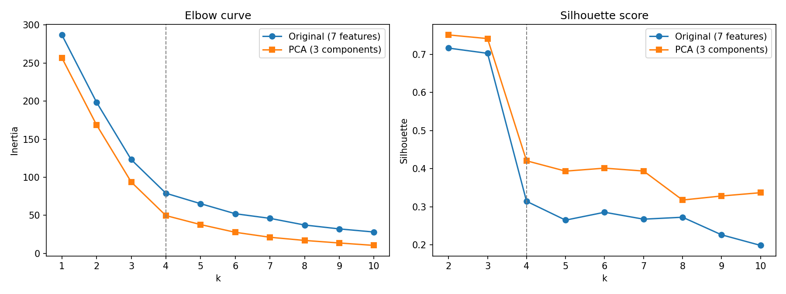
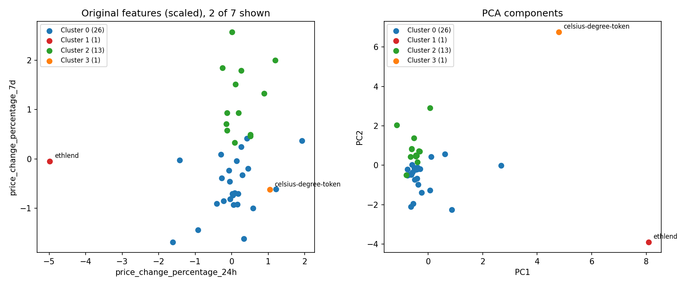

# Crypto Clustering

Unsupervised learning project that groups 41 cryptocurrencies by price-change behaviour with K-means, and tests whether PCA can reduce the feature space without changing the result.

## Data

`Resources/crypto_market_data.csv`: 41 coins, 7 features: price change percentage over 24 hours, 7, 14, 30, 60 and 200 days, and 1 year. Features are standardized with `StandardScaler` before clustering.

## Approach

1. Scale the 7 features and choose k with the **elbow method** (k = 1 to 10).
2. Cluster with K-means (fixed `random_state`, 10 initializations, so results are reproducible).
3. Reduce to **3 principal components** with PCA and repeat steps 1 and 2.
4. Check cluster separation with **silhouette scores**, and compare the two clusterings with the **adjusted Rand index** (1.0 = identical grouping).

## Results



- The three principal components retain **89.5%** of the variance.
- The elbow method points to **k = 4** for both the original and the PCA data.
- With k = 4, the original and PCA clusterings are **identical** (adjusted Rand index = 1.0). Three components are enough to reproduce the grouping from all seven features.

| k | 2 | 3 | 4 | 5 |
|---|---|---|---|---|
| Silhouette, original features | 0.717 | 0.703 | 0.314 | 0.265 |
| Silhouette, PCA components | 0.751 | 0.742 | 0.421 | 0.394 |

**Trade-off in choosing k = 4.** Silhouette scores are highest at k = 2 and 3 and drop by more than half at k = 4. Moving from 3 to 4 clusters splits a single coin into its own cluster. k = 4 is kept because it isolates both outliers, which is the more useful result for spotting unusual coins, at the cost of lower overall separation. Silhouette scores in PCA space are higher partly because there are fewer dimensions, so the two rows are not a like-for-like comparison.



**Clusters at k = 4:** a large group of 26 coins, a group of 13, and two single-coin clusters, `ethlend` and `celsius-degree-token`, which sit several standard deviations from the rest: `ethlend` combines the largest 24-hour drop with very large 200-day and 1-year gains, and `celsius-degree-token` has unusually large gains over 14 to 200 days. The PCA plot shows both outliers clearly because PC1 and PC2 summarize all seven features; the original-feature plot shows only two of them, so `celsius-degree-token` appears inside the main group there.

## Project Structure

```
├── Crypto_Clustering.ipynb       # analysis narrative (interactive hvPlot charts)
├── src/crypto_clustering.py      # scaling, PCA, K-means, elbow and silhouette helpers
├── scripts/make_figures.py       # renders the static PNGs in images/
├── images/
├── tests/
└── Resources/crypto_market_data.csv
```

The notebook's interactive hvPlot charts do not display on GitHub; the static figures above are generated from the same analysis.

## How to Run

```bash
python -m venv .venv && source .venv/bin/activate
pip install -r requirements-dev.txt
pytest -q
python scripts/make_figures.py
jupyter notebook Crypto_Clustering.ipynb
```

## Tech Stack

Python · pandas · scikit-learn (KMeans, PCA, StandardScaler, silhouette) · hvPlot · matplotlib · pytest · GitHub Actions
